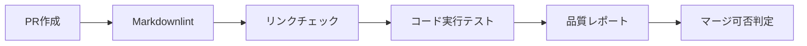

## 🎯 概要

ドキュメントの品質を継続的に保つため、リンクチェック、Markdown linting、コードブロック実行テストを自動化する。

## 📋 背景

Phase 1-3でドキュメント品質を向上させましたが、継続的な品質維持のためには自動化が必要です。

以下の課題を解決します：

- 壊れたリンクの早期発見
- Markdownフォーマットの統一維持
- コード例の動作保証
- ドキュメント更新の継続的な品質管理

## ✅ 実装内容

### 1. リンクチェック自動化（2日）

#### GitHub Actionsワークフロー作成

```yaml
# .github/workflows/docs-link-check.yml
name: Documentation Link Check
on:
  push:
    paths: ['docs/**']
  pull_request:
    paths: ['docs/**']
  schedule:
    - cron: '0 9 * * 1'  # 毎週月曜日9時
```

#### 実装内容

- [ ] 内部リンクの存在確認
- [ ] 外部リンクの生存確認
- [ ] 画像ファイルの存在確認
- [ ] アンカーリンクの妥当性チェック

### 2. Markdown Linting導入（1日）

#### markdownlint設定

```json
{
  "MD013": false,
  "MD033": false,
  "MD041": false
}
```

#### 実装内容

- [ ] `.markdownlint.json` 設定ファイル作成
- [ ] GitHub Actions統合
- [ ] VSCode拡張との連携設定
- [ ] プリコミットフック設定

### 3. コードブロック実行テスト（2日）

#### テスト対象

- [ ] JavaScript/TypeScript コードブロック
- [ ] Shell コマンド例
- [ ] 設定ファイル例
- [ ] API呼び出し例

#### 実装方法

- [ ] コードブロック抽出スクリプト
- [ ] 実行環境の準備
- [ ] 結果検証ロジック
- [ ] エラーレポート機能

## 📐 CI/CDパイプライン統合

### ワークフロー構成



### 品質ゲート

- [ ] Markdown linting: エラー0個
- [ ] 壊れたリンク: 0個
- [ ] コードブロック実行: 成功率100%
- [ ] 新規ドキュメント: フォーマット準拠

## 📊 監視ダッシュボード

### メトリクス

- [ ] ドキュメント品質スコア
- [ ] リンク健全性
- [ ] 更新頻度
- [ ] エラー発生件数

### レポート機能

- [ ] 週次品質レポート
- [ ] 壊れたリンク一覧
- [ ] コードエラー詳細
- [ ] 改善提案

## 📐 受け入れ基準

- [ ] リンクチェックが自動実行される
- [ ] Markdown lintingが統合されている
- [ ] コードブロックテストが動作する
- [ ] CI/CDパイプラインに統合されている
- [ ] エラー時の通知機能が動作する
- [ ] 品質メトリクスが可視化されている

## 🗓️ スケジュール

- **期間**: 5日
- **マイルストーン**: Continuous Improvement
- **優先度**: Enhancement

## 🔗 依存関係

- **前提条件**:
  - Phase 1-3の完了
  - GitHub Actions利用権限

## 🛠️ 技術仕様

### 使用ツール

- **リンクチェック**: markdown-link-check
- **Markdown Linting**: markdownlint-cli2
- **コード実行**: Node.js, Docker
- **CI/CD**: GitHub Actions
- **通知**: Slack, GitHub Issue

### 設定ファイル

```javascript
// .markdownlint.json
{
  "default": true,
  "MD013": false,  // 行長制限無効化
  "MD033": false,  // HTML許可
  "MD041": false   // 最初の行がh1でなくてもOK
}
```

## 📈 期待効果

### 短期効果

- [ ] 壊れたリンクの即座な発見
- [ ] フォーマット統一の自動維持
- [ ] コード例の信頼性向上

### 長期効果

- [ ] ドキュメント品質の継続的向上
- [ ] 保守コストの削減
- [ ] 開発者体験の向上

## 📎 関連ドキュメント

- `docs/DOCUMENTATION_IMPROVEMENT_PLAN.md`
- `.github/workflows/` 配下の既存ワークフロー

## 📝 補足事項

この自動化により、ドキュメント品質が継続的に保たれ、開発チームの生産性向上に貢献します。段階的な導入を推奨します。
